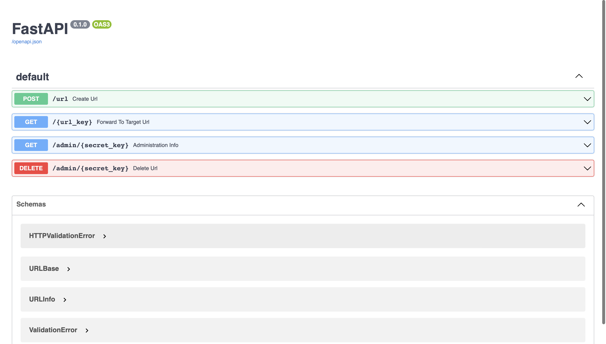

# <strong>URL Shortener</strong>

### [Deployement Link](https://xs-urlshortener.herokuapp.com)

URLs can be extremely long and not user-friendly. This is where a URL shortener can come in handy. A URL shortener reduces the number of characters in a URL, making it easier to read, remember, and share.

### Project Status
* Functionality-✅
* Heroku Deployment- ✅
* Frontend Application- 🚧

